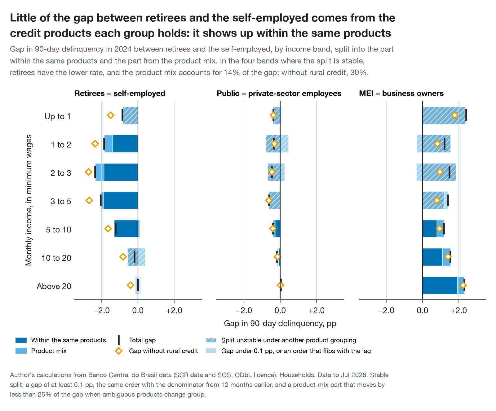

# brazil-consumer-credit-risk

**At the same income, does the kind of work you do change how often your debts go bad, or is it the kind of credit your work lets you get?**

*Com a mesma renda, o tipo de ocupação muda o risco de inadimplência, ou o que muda é o tipo de crédito a que cada ocupação tem acesso?*

**Short answer:** income separates credit risk more than occupation does. But at the same income, occupation still matters, and between retirees and the self-employed the gap sits within the same products, not in who can get payroll-deducted loans.

An analysis of household credit risk in Brazil, built on Banco Central do Brasil public data. It rebuilds, at national scale and from open sources, the segment view a credit-risk team reviews every month: where delinquency concentrates, and whether that comes from the borrowers or from the products they hold.

**Read the report:** [Português](analysis/index.qmd) (the reference version) · [English](analysis/en/index.qmd)

## Findings

Each finding is a chart headline, chosen from the data by a rule fixed before the results were known, with the headline that would have replaced it if the data had said the opposite ([`docs/v1-decision.md`](docs/v1-decision.md), section 4). Occupation here is the one declared on the income-tax return, so the occupation findings describe borrowers who file income tax (assumption 3).

1. **Little of the gap between retirees and the self-employed comes from the credit products each group holds: it shows up within the same products**
2. **On 90-day delinquency, income separates risk more than occupation does, and the gap between occupations didn't track unemployment**
3. **At the same income, 90-day delinquency varies by up to 2.5 pp with occupation**
4. **Since the accounting change, 15–90-day delinquency has risen most among the self-employed, and lending to them has kept growing in real terms**
5. **In each of the three episodes from 2018 to 2024, household 90-day delinquency moved mostly within each occupation and product**
6. **Part of the rise in household delinquency since January 2025 is an accounting change, not borrowers; 15–90-day delinquency didn't jump**



The second finding rejects the hypothesis this project started from, that occupation matters more than income, by the rule written for it in advance. The report says so, and so does this README.

## What I would do

For a consumer credit-risk team, the results point to five actions (the report gives the reasoning):

1. **Segment by income and product first.** Income separates risk the most, and portfolio delinquency moves with the rate inside each segment, not with the mix.
2. **Use occupation as a second cut, within product and income band,** starting with credit-card collections, where the gap between the self-employed and retirees on the same income is widest. Test it against the current collections strategy rather than assume the gain.
3. **Track early arrears (15–90 days) for the self-employed every month.** They are rising fastest while lending to them keeps growing.
4. **Don't compare the 90-day rate across January 2025.** Use the 15–90-day rate until the accounting effect settles.
5. **Validate occupation on account-level data before it goes into a scoring model.** These are portfolio rates, which mix lenders' choices with borrowers' repayment.

## The trap this project is built around

**SCR.data has a definitional break at January 2025, and it is not economic.** From that month, **Resolução CMN 4.966/2021**, Brazil's IFRS 9 equivalent, changed how lenders provision and write off loans. Lenders now keep defaulted loans on the books longer, so balances more than 90 days overdue grow even if nobody pays worse. The Banco Central estimates that about 70% of the rise in 90-day delinquency in the first half of 2025 came from the new rule ([Relatório de Política Monetária, Sep 2025](https://www.bcb.gov.br/content/ri/relatorioinflacao/202509/rpm202509b6p.pdf)). A series plotted straight through that date mixes accounting with behaviour.

So the 90-day rate is used only up to December 2024, and the 15–90-day rate, which write-offs don't reach, for anything after. A dbt test asserts that the break exists ([`assert_january_2025_break_exists.sql`](tests/dbt/assert_january_2025_break_exists.sql)) and fails if a future BCB revision removes it. The evidence is in [`docs/data-landscape.md`](docs/data-landscape.md).

## How the numbers are checked

- **The files.** Every archive is checked against its CRC before use, and its size, publication date and SHA-256 are recorded, because BCB republishes its history. The one republication since the download moved the household 90-day rate by at most 0.001 pp.
- **The data.** All 169 months, 43 million rows, were profiled before any modelling ([`docs/data-dictionary.md`](docs/data-dictionary.md)). 97 dbt data tests run on every build: grain, ranges, accounting identities, and reconciliation of the national 90-day rate to the Banco Central's official series within 0.2 pp in every month from 2017 to 2024. The card group's rate is also held within 0.75 pp of the official card series (SGS 21129) over the same months, a check of the product grouping against an outside source.
- **The method.** Every decomposition is tested to add up exactly, and the product grouping is re-run with ambiguous products moved; splits that depend on it are marked unstable.
- **The claims.** The report asserts every qualitative claim its text makes before it renders, so a data release that reverses one stops the render instead of publishing a false sentence. A test checks that this README's findings are the charts' headlines word for word.
- **An independent recomputation.** [`scripts/audit.py`](scripts/audit.py) recomputes the headline numbers straight from the raw monthly files, without dbt or the chart code, and checks that they match the report to 1e-9.

## Assumptions

The results depend on each of these. The ones marked *could be wrong* are tested, or shown both ways, rather than taken on trust.

1. **The 90-day rate is comparable from January 2017 to December 2024, and only then.** Occupations were reclassified in January 2017, and write-offs changed in January 2025. dbt tests enforce both ends.
2. **The 15–90-day rate is unaffected by the January 2025 change.** It rose 0.026 pp that January, against 0.010 pp a year earlier. *Could be wrong* if lenders changed how they report early arrears in ways one month can't show.
3. **The recorded occupation describes the borrower.** It is the occupation declared on the income-tax return, which BCB takes from the tax registry, so only people who file have one, and it isn't necessarily the current job. Non-filers appear, on all the evidence, as "Outros" (other), which holds about a quarter of household credit but about half of all loans, so the occupation findings describe tax filers, a more formal and better-off slice of borrowers. *Could be wrong:* a gap that changes sign when "Outros" is included is reported as fragile, not as a finding.
4. **An income band means the same thing within a calendar year, not across years.** Bands are multiples of the minimum wage, which resets every January, so every income comparison stays inside one year.
5. **Seven product groups are enough to separate product from occupation.** They come from a hand-built mapping of 68 modality and sub-modality pairs. *Could be wrong* for the ones whose group is a judgement call, such as card balances and unlabelled loans. So every split is re-run with those moved to their other plausible group and card purchases separated from card credit, and a split that shifts by more than a quarter of the gap is reported as unstable.
6. **A segment's rate describes the portfolio lenders built for it, not the people in it.** Rates are weighted by balance, one borrower can appear in several cells, and lenders decide who gets credit. Public data can't separate that choice from borrower behaviour, so no claim here is about how a group behaves.
7. **A cell needs R$1 bn of balance before its rate is ranked.** The threshold is a judgement. In 2024 it removes 16 of the 72 occupation-by-income cells, none of them in the headline comparisons.
8. **A share that moves more than 0.5 pp of household credit in one month is a reclassification, not lending.** Every documented reclassification since 2017 moves that much, except three minimum-wage resets. *Could be wrong* the other way: in nine months since 2017 a share moved that much with no documented cause, which may be real lending. Those months are flagged rather than read either way.
9. **The release used is final enough.** BCB republishes history. `make fetch` records each archive's publication date and SHA-256 in a manifest, and the data dictionary (section 8) lists the release this analysis used. The September 2026 republication moved the household 90-day rate by at most 0.001 pp.

## Reproducing it

Requires [uv](https://docs.astral.sh/uv/) and, for the report, [Quarto](https://quarto.org), on macOS or Linux. DuckDB runs in process, so there is no database server to set up.

```bash
uv sync
make fetch     # download, verify and stage SCR.data and the SGS series (about 25 minutes)
make build     # build the dbt models and run their data tests
make report    # draw the charts and render the report in both languages to analysis/_output/
make audit     # recompute the headline numbers from the raw files and compare
```

`make fetch` skips whatever is already downloaded, and keeps the local copy of an archive BCB has republished until `uv run fetch-data --refresh` replaces it; [`data/README.md`](data/README.md) has the details. `make test` and `make lint` run the Python checks; CI runs them and the dbt tests on every push, with the dbt tests on the 2023 to 2025 data.

The research behind the design is reproducible too: each script in `scripts/recon/` answers one research question, and [its index](scripts/recon/README.md) says which document uses it.

## Layout

```
src/             the pipeline package: fetch-data, the chart and report code
models/          dbt: staging, intermediate, marts, and the analysis models behind the charts
seeds/           dbt lookup tables: product groups, classification events, windows, occupation pairs
tests/           pytest, and the dbt data tests in tests/dbt/
analysis/        the report in Portuguese (index.qmd) and English (en/), and the charts
scripts/         audit.py, and the research scripts behind every figure in docs/ (recon/)
docs/            the research
```

| Document | What it covers |
|---|---|
| [`data-dictionary.md`](docs/data-dictionary.md) | every column, what it means, and every break in the series with its cause where one is documented |
| [`data-landscape.md`](docs/data-landscape.md) | the January 2025 break measured in the data, and what other public credit data exists and how it joins |
| [`analysis-design.md`](docs/analysis-design.md) | the decomposition, the confounds, the denominators, and what the data can't support |
| [`v1-decision.md`](docs/v1-decision.md) | the question, measures, windows and charts, and the alternatives that lost |

## Limitations

- **The data is aggregated.** There is no account-level public credit data in Brazil, because bank secrecy and the LGPD forbid it. Every conclusion is about portfolios, never individuals.
- **Lender selection can't be observed.** A segment's rate mixes whom lenders chose with how those borrowers repaid. Real growth next to each rate and a lagged denominator help read the effect, but don't remove it.
- **No vintages and no observed roll rates.** There is no origination-cohort dimension, and the data is stock by arrears band, not tracked accounts. The lagged denominator is a rough seasoning adjustment, not a vintage analysis.
- **Occupation findings describe income-tax filers.** Brazil's self-employed are mostly informal and don't file, so "self-employed" here means those who declare that occupation on a tax return.
- **Part of what moves the numbers isn't in the data.** Debt-renegotiation programmes (Desenrola), interest caps, rural postponements and refinancing, and the opening of payroll loans to private-sector workers in 2025 can change rates without any change in borrower behaviour. The report points out where they overlap with the results, with sources.
- **Correlation, not causation.** Nothing here says that changing occupation would change anyone's risk, or explains why the self-employed's loans go bad more often.
- **Two of the three occupation comparisons are weak.** Public against private-sector employees and micro-entrepreneurs against business owners have few income bands where the split is stable, so the findings rest on retirees against the self-employed.
- **The 15–90-day rate carries a small caveat since 2025.** Overdue amounts now include contractual interest until an asset becomes a problem asset, which may slightly raise balances 60 to 90 days overdue.

## Sources

- [BCB SCR.data](https://dadosabertos.bcb.gov.br/dataset/scr_data): monthly aggregated credit operations from July 2012
- [BCB SGS](https://www3.bcb.gov.br/sgspub/): official credit, delinquency and macro series
- [Resolução CMN 4.966/2021](https://www.bcb.gov.br/estabilidadefinanceira/exibenormativo?tipo=Resolu%C3%A7%C3%A3o%20CMN&numero=4966): the accounting change behind the January 2025 break

## Licence

Code: MIT, see [LICENSE](LICENSE). Data: published by the Banco Central do Brasil under the Open Database License (ODbL). Charts and reports built from it need attribution, and any derived dataset published from this repository must also be released under the ODbL. Details in [`data/README.md`](data/README.md).
