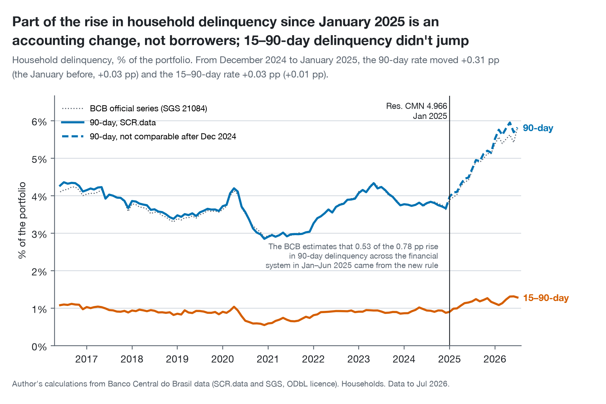
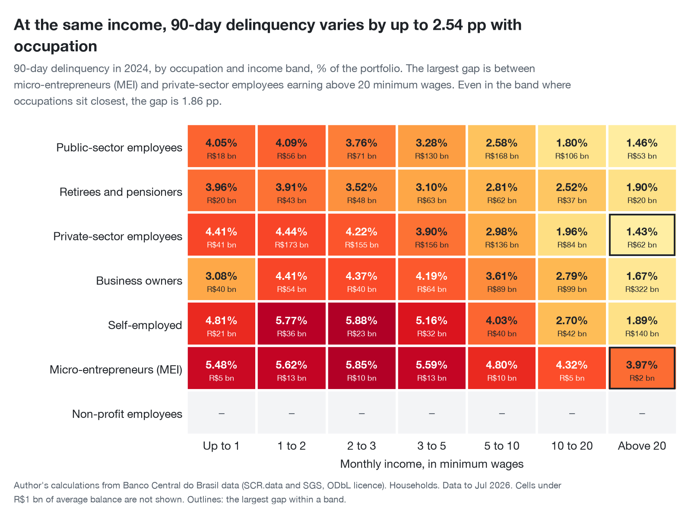
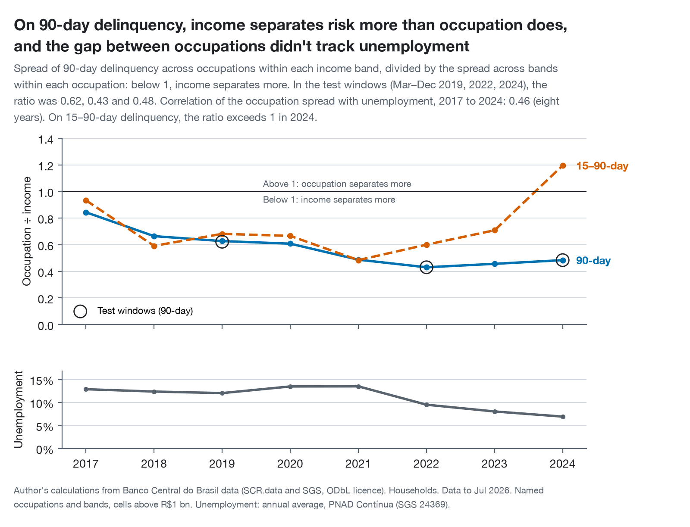
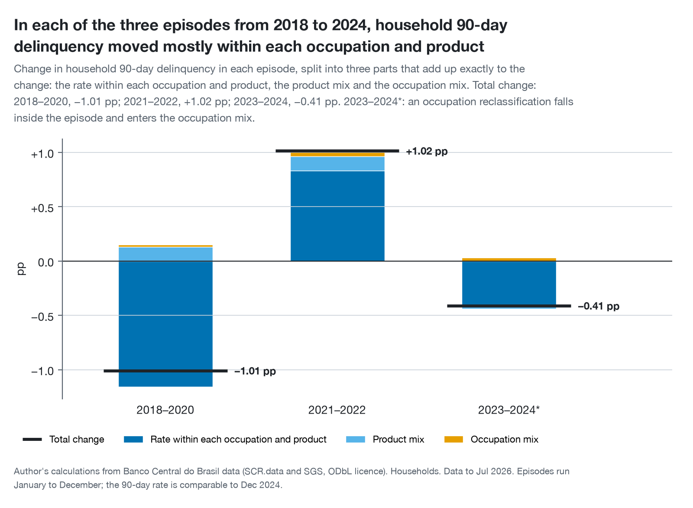
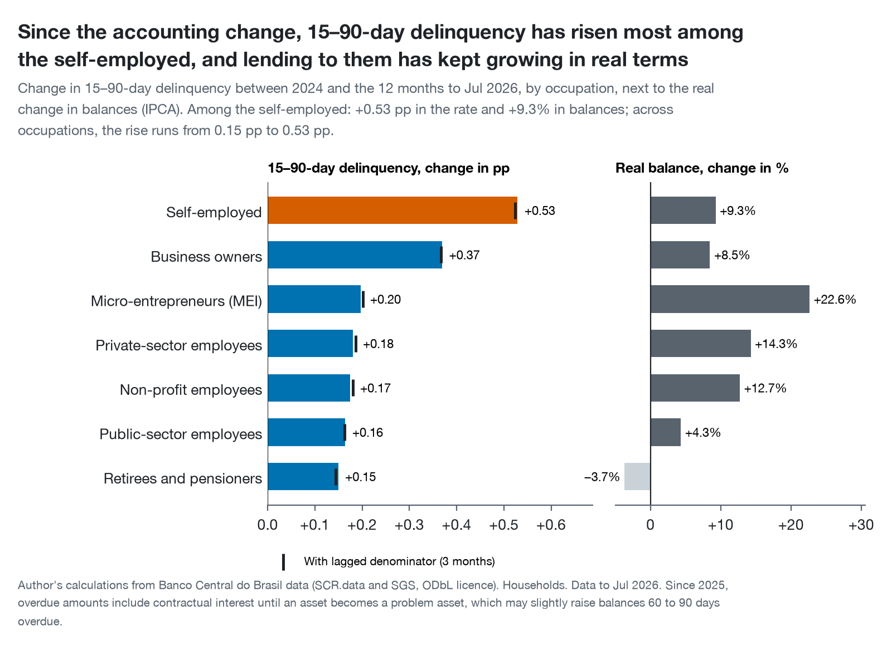

*Translated from the [Portuguese original](../index.html), which is the reference version.*

```{python}
#| include: false
# The same figures and the same checks as the Portuguese original, formatted in English
# (brazil_consumer_credit_risk.report).
from types import SimpleNamespace

from IPython.display import Markdown

from brazil_consumer_credit_risk import report
from brazil_consumer_credit_risk.charts.language import EN

facts = report.facts()
report.check(facts)
# "$" in "R$" is escaped so Pandoc never reads it as the start of a formula.
N = SimpleNamespace(
    **{k: Markdown(v.replace("$", "\\$")) for k, v in report.values(facts, EN).items()}
)
```

::: {.callout-note appearance="simple"}
## In brief

- **On 90-day delinquency, income separates risk more than occupation does.** In the three test
  windows, the spread across occupations was `{python} N.ratio_low` to `{python} N.ratio_high` of
  the spread across income bands.
- **But at the same income, occupation still matters:** the rate varies by up to
  `{python} N.grid_spread` with occupation.
- **Between retirees and the self-employed, the gap sits within the same products,** not in access
  to them: the product mix explains only `{python} N.mix_share` of it. On credit cards, the
  portfolio of the self-employed had a delinquency rate of `{python} N.card_self_employed`, against
  `{python} N.card_retirees` for retirees on the same income.
- **Part of the rise in delinquency since January 2025 is an accounting change.** On the measure
  that runs through the change, 15–90-day delinquency, the rise was largest among
  `{python} N.fastest`, whose credit kept growing.
- **What I would do:** segment by income and product first and use occupation as a second cut,
  starting with collections on `{python} N.top_product`, and validate it on account-level data before
  it goes into a scoring model.
- **About whom:** occupation in this data is the one declared on the income-tax return, so the
  occupation findings describe people who file, a more formal and better-off slice of borrowers
  (section 3).
:::

::: {.callout-tip appearance="simple" collapse="true"}
## Brazilian context, for readers outside Brazil

- **SCR.data** is the Banco Central do Brasil's public, monthly, aggregated view of its credit
  registry (SCR), which every regulated lender reports to.
- **Payroll-deducted loans (*consignado*)** are repaid straight from a salary or pension. Until 2025
  they went mainly to retirees, pensioners and public-sector employees and rarely went bad. Since
  March 2025 they have opened up to private-sector workers, a much riskier book (section 5.5).
- **Occupation** in SCR.data is the one declared on the income-tax return, which most borrowers
  don't file (section 3).
- **MEI** (*microempreendedor individual*) is a simplified tax registration for sole traders with a
  small turnover.
- **Income bands** are reported by lenders in multiples of the national minimum wage, which is
  reset every January.
- **Res. CMN 4.966** is Brazil's adoption of IFRS 9 expected-credit-loss accounting, in force from
  January 2025.
- **Figures are in reais (R\$),** with income in minimum wages, as published.
:::

# The question

**At the same income, does the kind of work you do change how often your debts go bad, or is it
the kind of credit your work lets you get?**

A retiree and a self-employed borrower on the same income look very different to a lender. The
retiree can get a payroll-deducted loan, repaid straight from the pension and rarely in arrears;
the self-employed borrower, usually, cannot. Part of the difference in risk between them may
therefore come from the products each can get, and not from how each repays. This analysis
separates the two.

# Why it matters

For a credit risk team, the answer changes three decisions:

- **Collections.** If occupation says something about risk within the same product and the same
  income, it helps decide whom to contact first. If it doesn't, it only repeats what the product
  already tells you.
- **Pricing and credit policy.** A gap that comes from the product is handled product by product.
  One that comes from the borrower is handled at origination.
- **Monitoring.** Knowing whether delinquency moves with the make-up of the portfolio or with
  behaviour within each segment tells you where to look when it rises.

# The data

The Banco Central's **SCR.data** publishes, every month, the credit balances of the financial
system and the amounts in arrears, aggregated by occupation, income band, credit type, type of
lender and state. It covers `{python} N.months` months, from `{python} N.first_month` to
`{python} N.latest_month`; in `{python} N.latest_month`, household credit totalled
`{python} N.portfolio`.

The analysis uses two measures, both as a share of the portfolio balance:

- **90-day delinquency:** the balance of loans with an instalment more than 90 days past due. It is
  the Banco Central's official concept; between 2017 and 2024, the series computed here stays
  between `{python} N.sgs_gap_low` and `{python} N.sgs_gap_high` of the official series (SGS 21084).
- **15–90-day delinquency:** the amounts overdue within that range. It is the only measure that
  runs through the 2025 accounting change (section 4).

The comparisons cross `{python} N.occupations` occupations, `{python} N.income_bands` income bands
and `{python} N.product_groups` product groups. Three choices make them comparable:

- **They start in January 2017,** when occupations were reclassified and the rate of every named
  occupation jumped while the national rate didn't move.
- **They compare income bands only within a single year.** The bands are multiples of the minimum
  wage, which changes every January.
- **They leave the residual categories out of comparisons:** the occupation "Other", which holds
  `{python} N.outros_low` to `{python} N.outros_high` of the portfolio, and the income codes
  "Unavailable" and "No income". They stay in the totals. Cells with less than
  `{python} N.min_cell` of average balance don't have their rates compared either.

**Occupation is the one declared on the income-tax return.** The Banco Central receives it from the
federal tax registry, and only people who file a return have one: `{python} N.tax_returns_2026`
returns were filed in 2026, against `{python} N.borrowers_2019` borrowers in the SCR as early as
2019.[^occupation] Non-filers appear, on all the evidence, as "Other": in 2024 it held
`{python} N.outros_balance_2024` of the balance but `{python} N.outros_loans_2024` of all loans, and
`{python} N.outros_lowest_band` of the credit in the band up to 1 minimum wage. So the occupation
findings describe people who file income tax. "The self-employed" are those who declare themselves
so to the tax authority, not Brazil's `{python} N.self_employed_2025` self-employed workers, of whom
only `{python} N.self_employed_with_cnpj` have a business registration.[^pnad] And
`{python} N.retiree_above_one_wage` of "retirees'" credit is in bands above 1 minimum wage.

SCR.data is aggregated: there is no public account-level credit data in Brazil. So nothing here is
about people; it is about portfolios: "the portfolio lenders built with the self-employed had a
delinquency rate of X", never "the self-employed pay X". Nor does the data allow vintage analysis
or observed roll rates between arrears buckets (section 7).

# The trap: the January 2025 accounting change

{fig-alt="Household 90-day and 15–90-day delinquency, June 2016 to July 2026, with the January 2025 change marked."}

In January 2025, **Resolution CMN 4.966** brought IFRS 9 expected-loss accounting to Brazil. The
effect that moves the numbers most is not the new definition of a problem asset but write-offs:
lenders now keep defaulted loans on the books for longer, so the balance more than 90 days overdue
grows even if nobody starts paying worse. The Banco Central estimates that
`{python} N.bcb_regulatory` of the `{python} N.bcb_total` rise in the financial system's 90-day
delinquency in the first half of 2025 came from the new rule.

**How the break showed up.** Comparing December with January, household 90-day delinquency rose
`{python} N.d90_step` in January 2025, against `{python} N.d90_step_before` the January before.
15–90-day delinquency moved `{python} N.d15_step`, against `{python} N.d15_step_before`: an
ordinary January. The count of days past due didn't change, and write-offs don't reach loans less
than 90 days overdue.

**How it was handled.** 90-day delinquency is used only up to December 2024; after that, only
15–90-day delinquency. A data test in the pipeline confirms the break exists and fails if a future
revision by the Banco Central removes it.

# Findings

## At the same income, occupation still changes delinquency

{fig-alt="Heat map of 90-day delinquency in 2024 by occupation and income band."}

Within each income band, the 90-day rate in 2024 varies with occupation. The largest gap is
`{python} N.grid_spread`, between `{python} N.grid_high` and `{python} N.grid_low` earning
`{python} N.grid_band`. Even in the band where occupations sit closest, the gap is
`{python} N.grid_smallest`. The largest gap keeps its order with the lagged denominator, which
discounts the effect of portfolios that grew fast. In `{python} N.top_two_riskiest` of the
`{python} N.bands_shown` bands, the two highest rates belong to micro-entrepreneurs (MEI) and the
self-employed; in `{python} N.safest`, the lowest belongs to public-sector employees or retirees.
The `{python} N.small_cells` cells for non-profit employees fall below the minimum size.

## But income separates risk more than occupation does

{fig-alt="Ratio of the spread of delinquency across occupations to the spread across income bands, 2017 to 2024, with unemployment below."}

The question that settles how much occupation matters is which of the two dimensions pulls rates
further apart. The chart's ratio divides the spread across occupations, within each income band,
by the spread across income bands, within each occupation. **On 90-day delinquency, it stayed
below 1 in every year from 2017 to 2024** and, in the three windows set before the analysis,
between `{python} N.ratio_low` and `{python} N.ratio_high`.

The hypothesis "occupation matters more than income" was written in advance, with the rule that
would reject it: income separating more in all three windows. That is what happened. Two caveats:

- **15–90-day delinquency disagrees in `{python} N.d15_years`.** That year, occupation separated
  early arrears more than income did. With a single year, it is a signal to watch, not a
  conclusion.
- **The gap between occupations didn't track unemployment** (a correlation of
  `{python} N.correlation` over `{python} N.years` years). The hypothesis that the kind of work
  matters more when jobs are scarcer finds no support here, but so few annual points couldn't
  confirm it either.

## Between retirees and the self-employed, the gap sits within the same products

{fig-alt="Gap in 90-day delinquency between three pairs of occupations, by income band, split into the part within the same products and the part from the product mix."}

This is the central test. For each pair of occupations and each income band, the gap in rates
splits exactly into two parts: the part that exists within the same products, and the part that
comes from each group holding different products. If the gap between retirees and the
self-employed came from access to payroll-deducted loans, the second part would dominate.

**It doesn't.** In the `{python} N.split_bands` bands where the split is stable
(`{python} N.split_band_names`), the product mix explains `{python} N.mix_share` of the gap.
Without rural credit, which is `{python} N.rural_self_employed` of the self-employed's portfolio,
the product-mix part rises to `{python} N.mix_share_no_rural`, still well short of half. The
portfolio of the self-employed has higher delinquency in every product. On credit cards, at the
same income, it was `{python} N.card_self_employed` against `{python} N.card_retirees`; even on
payroll-deducted loans, `{python} N.payroll_self_employed` against `{python} N.payroll_retirees`.
The product that contributes most to the gap within the same products is `{python} N.top_product`:
`{python} N.top_product_share` of it.

A split counts as stable only if it passes three filters:

- the gap is at least `{python} N.material`;
- the order of the two occupations holds with the lagged denominator;
- the split moves by less than `{python} N.crosswalk_shift` of the gap when products with an
  ambiguous classification change group.

In 2024, only `{python} N.stable_splits` of the `{python} N.material_splits` splits with a material
gap passed. In the other two pairs, the few stable bands point the same way: the product mix
explains `{python} N.public_share` of the gap between public- and private-sector employees and
`{python} N.mei_share` of the gap between micro-entrepreneurs and business owners. For those pairs,
though, the conclusion is weaker, because most of their bands fail the test.

## Changes in national delinquency came from within segments

{fig-alt="Change in 90-day delinquency over three episodes, split into the rate within each occupation and product, the product mix and the occupation mix."}

The same split, applied over time, asks whether national delinquency rose or fell because credit
moved towards riskier products or occupations, or because rates changed within each segment. In
the `{python} N.episodes` episodes from 2018 to 2024, **the change within each occupation and
product explained `{python} N.pure_low` to `{python} N.pure_high` of the movement**; where that
part exceeds 100%, the portfolio mix moved the other way. The two mix effects together never
exceeded `{python} N.mix_max` of it. The `{python} N.flagged_episode` episode contains an
occupation reclassification, which enters the occupation mix; there, that mix came to
`{python} N.flagged_borrower_mix`. Two things outside the data overlap that episode: Desenrola
Brasil, which renegotiated `{python} N.desenrola_amount` of debt for `{python} N.desenrola_people`
people between July 2023 and May 2024, and the cap on revolving card interest, in force since
January 2024.[^desenrola] Part of the fall within segments may be renegotiation rather than better
repayment.

## Since 2025, early arrears have risen most among the self-employed

{fig-alt="Change in 15–90-day delinquency by occupation between 2024 and the 12 months to July 2026, next to the real change in balances."}

15–90-day delinquency over the last 12 months, compared with 2024, rose for every occupation. The
rise was largest among `{python} N.fastest` (`{python} N.fastest_change`), while the real balance of
credit to them grew `{python} N.fastest_growth`. The smallest was among `{python} N.slowest`
(`{python} N.slowest_change`, with a real balance change of `{python} N.slowest_growth`). The order doesn't
change with the lagged denominator. A rate that rises while credit keeps growing can't be put down
to a shrinking portfolio: it is the kind of signal worth watching month by month.

Four changes from outside the data run through this comparison:[^context]

- **Payroll loans opened up to the private sector.** Private-sector employees could already take
  payroll-deducted loans, but only where their employer had an agreement with a bank. Since March
  2025, under the Crédito do Trabalhador, they can take them through eSocial, the government's
  payroll system, with no agreement needed. Their payroll-loan balance went from
  `{python} N.private_payroll_before` in January 2025 to `{python} N.private_payroll_latest` in
  `{python} N.latest_month`, and its 15–90-day delinquency, in three-month averages, from
  `{python} N.private_payroll_d15_before` to `{python} N.private_payroll_d15_latest`. It is a new,
  riskier part of the "payroll loans" group.
- **Credit to retirees shrank on the supply side.** The interest cap on pensioners' payroll loans
  stayed frozen while the Selic rose, and major banks suspended the product at the end of 2024. The
  smaller real balance of retirees coincides with that pullback, so it says nothing about how they
  repay.
- **Rural credit was postponed and refinanced.** Instalments in Rio Grande do Sul were postponed
  after the 2024 floods, and MP 1.314/2025 set aside `{python} N.rural_refinancing` of Treasury
  funds to refinance rural debt from September 2025. Refinanced debt leaves arrears, so the rural
  figures tend to understate the strain, which falls on the self-employed and the top income band,
  where rural credit is concentrated.
- **2026 has reliefs of its own.** Income up to `{python} N.tax_exemption` a month has been exempt
  from income tax since January 2026, and the Novo Desenrola, launched in May 2026 with up to
  `{python} N.novo_desenrola` in guarantees, renegotiates debt within this chart's window.

# What I would do

The analysis was designed with two recommendations written before the results, one for each
possible answer to the central test. The answer was that the gap sits within the same products.
Taken together with income being the stronger separator, it leads to five actions for a consumer
credit risk team:

1. **Segment by income and product first.** Income separates risk the most, and what moves
   portfolio delinquency is the rate within each segment, not the mix.
2. **Use occupation as a second cut, within product and income band.** It carries information the
   product doesn't. The place to start is collections on `{python} N.top_product`, where the gap
   between the self-employed and retirees on the same income is widest. In the collections
   strategy, that suggests reaching the self-employed first among customers in the same income
   band, and measuring the gain against the current strategy.
3. **Track 15–90-day delinquency every month for `{python} N.fastest`, and for private-sector
   payroll loans.** The first is rising faster than for other occupations while their portfolio is
   still growing; the second has grown fast since the 2025 opening and is already falling behind
   more.
   15–90-day delinquency is the measure that doesn't depend on the accounting rule.
4. **Don't compare 90-day delinquency before and after January 2025.** Reports that do mix an
   accounting rule with borrower behaviour. Until the effect settles, 15–90-day delinquency is the
   honest comparison.
5. **Validate on account-level data before occupation goes into a scoring model.** The rates here
   are portfolio rates: they mix whom lenders chose with how those borrowers repaid. Occupation
   comes from a registry, and "Other" holds `{python} N.outros_low` to `{python} N.outros_high` of
   the balance. A test on internal, account-level data is the natural next step.

# Limitations

- **The data is aggregated.** Each rate belongs to a portfolio, weighted by balance, and is not the
  share of people who fell behind. The same person can appear in different income bands at
  different lenders.
- **Lender selection can't be observed.** A segment's rate mixes whom lenders chose with how those
  borrowers repaid. Real growth next to each rate and the lagged denominator help read the effect,
  but don't remove it.
- **No vintages and no observed roll rates.** SCR.data doesn't record origination dates or follow
  loans from one arrears bucket to the next; the lagged denominator is a rough seasoning
  adjustment, not a vintage analysis.
- **Correlation, not causation.** Nothing here says that changing occupation would change anyone's
  risk.
- **Occupation is the one declared on the income-tax return.** Only filers have one; the rest, on
  all the evidence, are in "Other", which holds about a quarter of the balance and half of all
  loans. The occupation findings hold for filers, and a declared occupation isn't always the
  current job. Occupations were also reclassified in several Januaries. Since 2017, `{python} N.unexplained_jumps` months saw a jump of more than
  `{python} N.weight_jump` in the share of an occupation or income band with no known cause; they
  are flagged as reclassifications, and a test fails if a new one appears.
- **Income is reported by the lender, in bands of the minimum wage.** The bands move every January,
  so income is only compared within a single year, never as "the same income" across years.
- **The product grouping is a judgement.** Some of the splits between occupation and product change
  when ambiguous products change group, and those are flagged as unstable. The conclusions for
  public- against private-sector employees and for micro-entrepreneurs against business owners are
  the weaker ones for that reason.
- **15–90-day delinquency carries a small caveat since 2025.** Overdue amounts now include
  contractual interest until an asset becomes a problem asset, which may slightly raise balances
  60 to 90 days overdue.
- **Part of what moves the numbers isn't in the data.** Renegotiation programmes, interest caps,
  rural postponements and the opening of payroll loans to the private sector can change the rates
  without any change in how borrowers behave. Section 5 points out where they overlap with the
  results, but SCR.data can't separate their effects.
- **The Banco Central republishes its history.** The analysis uses the file versions recorded, with
  dates and hashes, in the repository. A later version can move the numbers slightly; the September
  2026 one moved household 90-day delinquency by at most 0.001 pp.

# How to reproduce

All the code is in the
[viniciusdoricio/brazil-consumer-credit-risk](https://github.com/viniciusdoricio/brazil-consumer-credit-risk)
repository. On a Mac or Linux machine with [uv](https://docs.astral.sh/uv/) and
[Quarto](https://quarto.org):

```bash
uv sync
make fetch     # downloads and verifies the Banco Central files (about 25 minutes)
make build     # dbt models and data tests
make report    # draws the charts and renders this report, in both languages
```

The data is published by the Banco Central do Brasil under the Open Database License (ODbL).

[^occupation]: Banco Central, [Estudo Especial 80/2020](https://www.bcb.gov.br/conteudo/relatorioinflacao/EstudosEspeciais/EE080_Indicadores_de_endividamento_de_risco_e_perfil_do_tomador_de_credito.pdf) (SCR borrowers, December 2019); Receita Federal, via [Poder360](https://www.poder360.com.br/poder-economia/receita-federal-recebe-445-milhoes-de-declaracoes-do-ir/) (returns filed in 2026). Where occupation comes from is documented in the repository's data dictionary, section 10.4.

[^pnad]: IBGE, [PNAD Contínua 2025](https://agenciadenoticias.ibge.gov.br/agencia-sala-de-imprensa/2013-agencia-de-noticias/releases/45759-pnad-continua-em-2025-taxa-anual-de-desocupacao-foi-de-5-6-enquanto-taxa-de-subutilizacao-foi-14-5); [Agência Brasil](https://agenciabrasil.ebc.com.br/economia/noticia/2025-11/apenas-um-em-cada-quatro-trabalhadores-por-conta-propria-tem-cnpj) on business registration.

[^desenrola]: Ministério da Fazenda, via [Agência Gov](https://agenciagov.ebc.com.br/noticias/202405/desenrola-brasil-encerra-com-beneficio-a-mais-de-15-milhoes-de-pessoas-e-reducao-da-inadimplencia-entre-a-populacao-mais-vulneravel-do-pais); Lei 14.690/2023, art. 28, and Resolution CMN 5.112/2023, via [Rádio Senado](https://www12.senado.leg.br/radio/1/noticia/2024/01/03/novo-limite-para-juros-do-cartao-de-credito-foi-fruto-de-lei-aprovada-no-congresso).

[^context]: Crédito do Trabalhador: [Exame](https://exame.com/brasil/consignado-privado-cresce-mas-valor-medio-dos-emprestimos-cai-73/). Pensioners' payroll-loan cap: [Ministério da Previdência](https://www.gov.br/previdencia/pt-br/noticias/2025/janeiro/taxa-maxima-de-juros-do-consignado-sobe-para-1-80-ao-mes) and [Mix Vale](https://www.mixvale.com.br/2025/02/02/credito-consignado-do-inss-cresce-30-em-2024-e-atinge-r-103-bilhoes-com-novas-taxas/). Rio Grande do Sul: Resolutions CMN 5.132/2024 and 5.164/2024, via [Ministério da Fazenda](https://www.gov.br/fazenda/pt-br/canais_atendimento/imprensa/notas-a-imprensa/2024/maio/cmn-autoriza-prorrogacao-de-credito-rural-em-municipios-do-rio-grande-do-sul). MP 1.314/2025: [CNN Brasil](https://www.cnnbrasil.com.br/economia/governo-publica-mp-que-libera-r-12-bi-para-renegociacao-de-dividas-rurais/). Income-tax exemption, Lei 15.270/2025: [Senado Notícias](https://www12.senado.leg.br/noticias/materias/2025/11/27/sancionada-isencao-do-imposto-de-renda-para-quem-ganha-ate-r-5-mil-por-mes). Novo Desenrola: [Forbes Brasil](https://forbes.com.br/forbes-money/2026/05/governo-lanca-novo-desenrola-com-ate-r-15-bi-em-garantias-da-uniao-para-renegociacao-de-dividas/).
