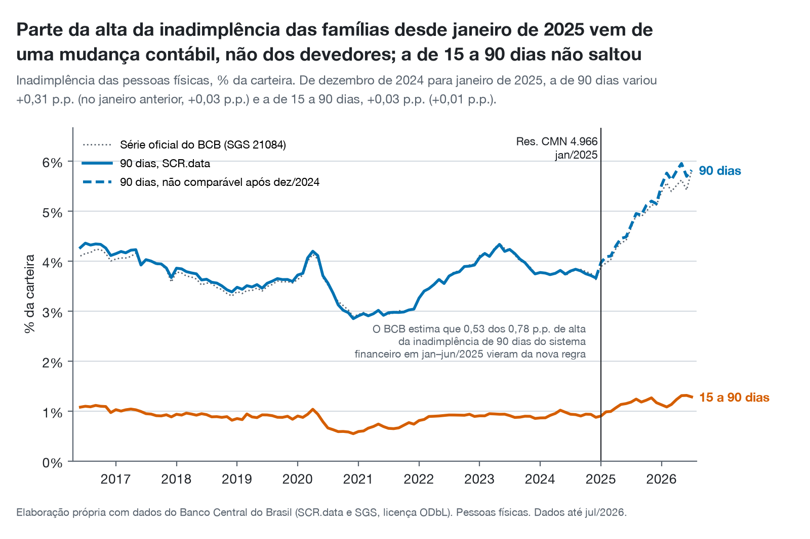
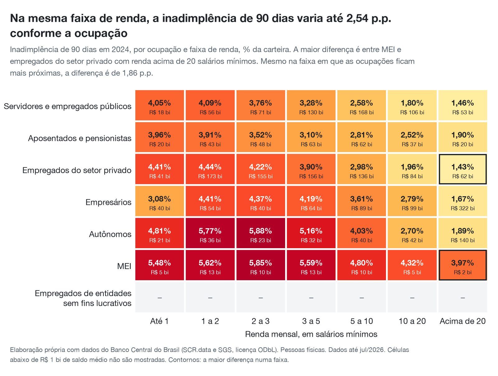
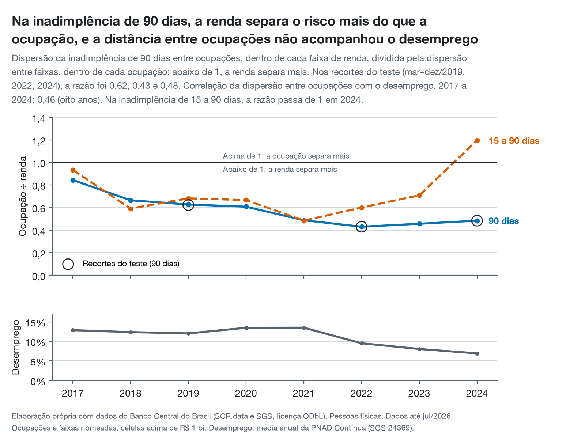
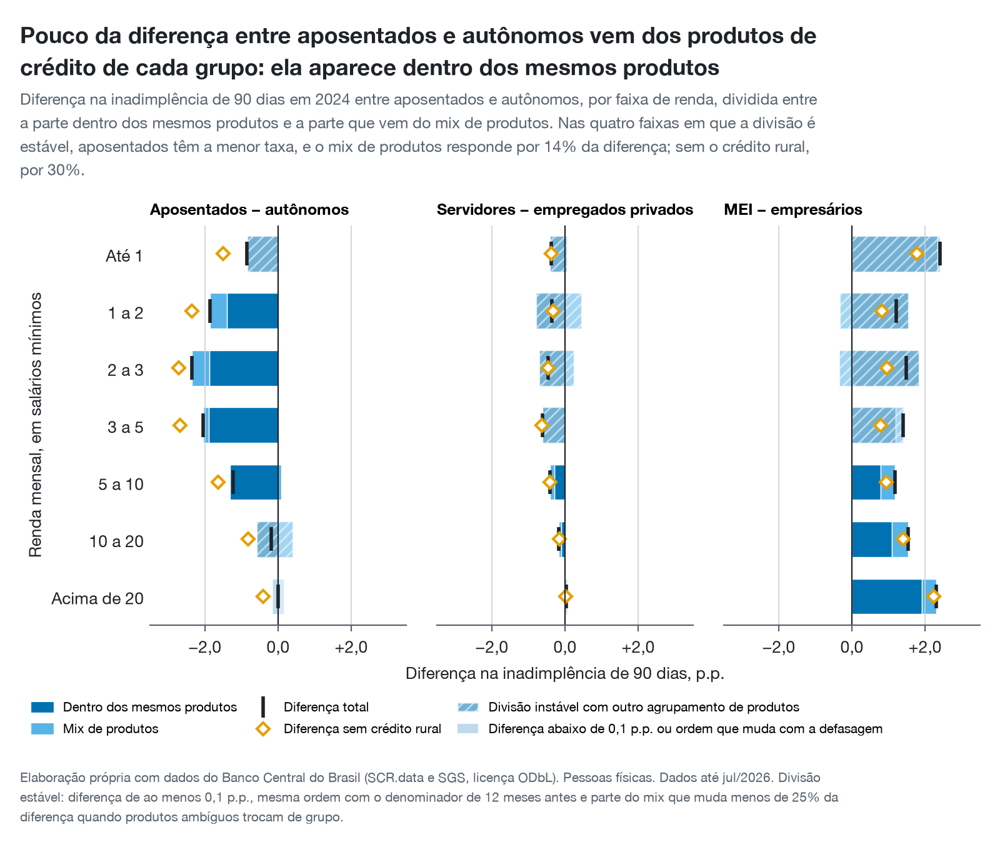
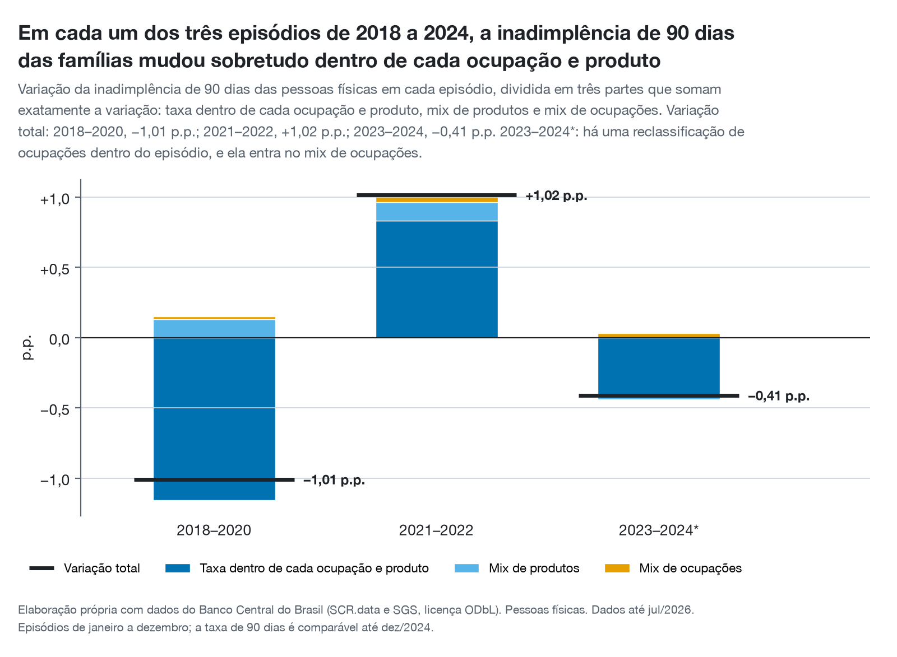
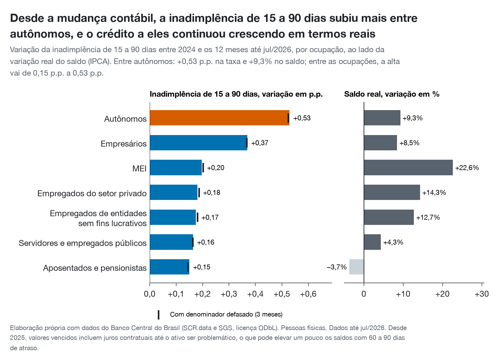

*[English version](en/index.html)*

```{python}
#| include: false
# Every figure from the data is computed in brazil_consumer_credit_risk.report, which the English
# translation (en/index.qmd) also uses, and every claim the text makes is checked there first.
from types import SimpleNamespace

from IPython.display import Markdown

from brazil_consumer_credit_risk import report
from brazil_consumer_credit_risk.charts.language import PT

facts = report.facts()
report.check(facts)
# "$" in "R$" is escaped so Pandoc never reads it as the start of a formula.
N = SimpleNamespace(
    **{k: Markdown(v.replace("$", "\\$")) for k, v in report.values(facts, PT).items()}
)
```

::: {.callout-note appearance="simple"}
## Em resumo

- **Na inadimplência de 90 dias, a renda separa o risco mais do que a ocupação.** Nos três recortes
  do teste, a distância entre ocupações foi de `{python} N.ratio_low` a `{python} N.ratio_high` da
  distância entre faixas de renda.
- **Mas, na mesma renda, a ocupação ainda pesa:** a taxa varia até `{python} N.grid_spread`
  conforme a ocupação.
- **Entre aposentados e autônomos, a diferença está dentro dos mesmos produtos,** não no acesso a
  eles: o mix de produtos explica só `{python} N.mix_share` dela. No cartão de crédito, a carteira
  dos autônomos teve `{python} N.card_self_employed` de inadimplência, contra
  `{python} N.card_retirees` da dos aposentados com a mesma renda.
- **Parte da alta da inadimplência desde janeiro de 2025 é contábil.** Na medida que atravessa a
  mudança, a de 15 a 90 dias, a alta foi maior entre `{python} N.fastest`, cujo crédito continuou
  crescendo.
- **O que eu faria:** segmentar primeiro por renda e produto e usar a ocupação como segundo corte,
  começando pela cobrança de `{python} N.top_product`, e validá-la em dados de conta antes de
  levá-la a um modelo de escore.
- **Sobre quem:** a ocupação nos dados é a declarada no imposto de renda, então os resultados por
  ocupação valem para quem declara, uma parcela mais formal e de renda mais alta dos tomadores
  (@sec-dados).
:::

# A pergunta

**Com a mesma renda, o tipo de ocupação muda o risco de inadimplência, ou o que muda é o tipo de
crédito a que cada ocupação tem acesso?**

Um aposentado e um autônomo que ganham o mesmo parecem muito diferentes para um credor. O
aposentado tem acesso ao consignado, com desconto em folha e inadimplência baixa; o autônomo, em
geral, não.
Parte da diferença de risco entre os dois pode vir, portanto, dos produtos que cada um consegue, e
não de como cada um paga. Esta análise separa as duas coisas.

# Por que importa

Para uma área de risco de crédito, a resposta muda três decisões:

- **Cobrança.** Se a ocupação diz algo sobre o risco dentro do mesmo produto e da mesma renda, ela
  ajuda a decidir quem contatar primeiro. Se não diz, só repete o que o produto já informa.
- **Preço e política de crédito.** Uma diferença que vem do produto se trata por produto. Uma que
  vem do devedor se trata na concessão.
- **Monitoramento.** Saber se a inadimplência se move pela composição da carteira ou pelo
  comportamento dentro de cada segmento diz onde olhar quando ela sobe.

# Os dados {#sec-dados}

O **SCR.data** do Banco Central publica, todo mês, o saldo de crédito do sistema financeiro e os
valores em atraso, agregados por ocupação, faixa de renda, modalidade, tipo de instituição e estado.
São `{python} N.months` meses, de `{python} N.first_month` a `{python} N.latest_month`; em
`{python} N.latest_month`, a carteira das pessoas físicas somava `{python} N.portfolio`.

A análise usa duas medidas, ambas como fração do saldo da carteira:

- **Inadimplência de 90 dias:** o saldo das operações com parcela vencida há mais de 90 dias. É o
  conceito oficial do Banco Central; entre 2017 e 2024, a série calculada aqui fica entre
  `{python} N.sgs_gap_low` e `{python} N.sgs_gap_high` da série oficial (SGS 21084).
- **Inadimplência de 15 a 90 dias:** os valores vencidos nesse intervalo. É a única medida que
  atravessa a mudança contábil de 2025 (@sec-armadilha).

As comparações cruzam `{python} N.occupations` ocupações, `{python} N.income_bands` faixas de renda e
`{python} N.product_groups` grupos de produto. Três escolhas as tornam comparáveis:

- **Começam em janeiro de 2017,** quando as ocupações foram reclassificadas e a taxa de todas as
  ocupações nomeadas saltou sem que a taxa nacional se mexesse.
- **Comparam faixas de renda só dentro de um mesmo ano.** As faixas são múltiplos do salário mínimo,
  que muda todo janeiro.
- **Deixam de fora das comparações as categorias residuais:** a ocupação "Outros", que tem
  `{python} N.outros_low` a `{python} N.outros_high` da carteira, e as rendas "Indisponível" e "Sem
  rendimento". Elas continuam nos totais. Células com menos de `{python} N.min_cell` de saldo médio
  também não têm a taxa comparada.

**A ocupação é a declarada no imposto de renda.** O Banco Central a recebe do cadastro da Receita
Federal, e ela só existe para quem entrega a declaração: foram `{python} N.tax_returns_2026` de
declarações em 2026, para `{python} N.borrowers_2019` de tomadores de crédito no SCR já em
2019.[^ocupacao] Quem não declara aparece, ao que tudo indica, como "Outros": em 2024, essa categoria
tinha `{python} N.outros_balance_2024` do saldo, mas `{python} N.outros_loans_2024` das operações, e
`{python} N.outros_lowest_band` do crédito da faixa de até 1 salário mínimo. Os resultados por
ocupação descrevem, portanto, quem declara imposto de renda. "Autônomos" são os que se declaram
assim à Receita, não os `{python} N.self_employed_2025` de trabalhadores por conta própria do país,
dos quais só `{python} N.self_employed_with_cnpj` têm CNPJ.[^pnad] E `{python} N.retiree_above_one_wage`
do crédito dos "aposentados" está em faixas acima de 1 salário mínimo.

O SCR.data é agregado: não existe dado público de crédito por conta no Brasil. Por isso, nada aqui
é sobre pessoas, e sim sobre carteiras: "a carteira que os credores formaram com autônomos teve
inadimplência de X", nunca "autônomos pagam X". Os dados também não permitem análise de safras nem
de rolagem observada entre faixas de atraso (@sec-limitacoes).

# A armadilha: a mudança contábil de janeiro de 2025 {#sec-armadilha}

{fig-alt="Inadimplência de 90 dias e de 15 a 90 dias das pessoas físicas, de junho de 2016 a julho de 2026, com a mudança de janeiro de 2025 marcada."}

Em janeiro de 2025, a **Resolução CMN 4.966** trouxe para o Brasil o modelo de perda esperada do
IFRS 9. O efeito que mais mexe nos números não é a nova definição de ativo problemático, e sim a
baixa a prejuízo: os credores passaram a manter por mais tempo na carteira os empréstimos
inadimplentes, e o saldo com mais de 90 dias de atraso cresce mesmo que ninguém passe a pagar
pior. O Banco Central estima que `{python} N.bcb_regulatory` da alta de `{python} N.bcb_total` na
inadimplência de 90 dias do sistema financeiro no primeiro semestre de 2025 vieram da nova regra.

**Como a quebra apareceu.** Ao comparar dezembro com janeiro, a inadimplência de 90 dias das
famílias subiu `{python} N.d90_step` em janeiro de 2025, contra `{python} N.d90_step_before` no
janeiro anterior. A de 15 a 90 dias variou `{python} N.d15_step`, contra
`{python} N.d15_step_before`: um janeiro comum. A contagem de dias de atraso não mudou, e a baixa a
prejuízo não alcança operações com menos de 90 dias.

**Como foi tratada.** A inadimplência de 90 dias só é usada até dezembro de 2024; depois disso,
só a de 15 a 90 dias. Um teste de dados no pipeline confirma que a quebra existe e falha se uma
revisão futura do Banco Central a apagar.

# Resultados {#sec-resultados}

## Na mesma renda, a ocupação ainda muda a inadimplência

{fig-alt="Mapa de calor da inadimplência de 90 dias em 2024 por ocupação e faixa de renda."}

Dentro de cada faixa de renda, a taxa de 90 dias em 2024 varia com a ocupação. A maior diferença é
de `{python} N.grid_spread`, entre `{python} N.grid_high` e `{python} N.grid_low` com renda
`{python} N.grid_band`. Mesmo na faixa em que as ocupações ficam mais próximas, a diferença é de
`{python} N.grid_smallest` A maior diferença mantém a ordem com o denominador defasado, que
desconta o efeito de carteiras que cresceram rápido. Em `{python} N.top_two_riskiest` das
`{python} N.bands_shown` faixas, as duas taxas mais altas são as de MEI e autônomos; em
`{python} N.safest`, a mais baixa é a de servidores ou aposentados. As `{python} N.small_cells`
células de empregados de entidades sem fins lucrativos ficam abaixo do tamanho mínimo.

## Mas a renda separa mais o risco do que a ocupação

{fig-alt="Razão entre a dispersão da inadimplência entre ocupações e entre faixas de renda, de 2017 a 2024, com o desemprego abaixo."}

A pergunta que decide o peso da ocupação é qual das duas dimensões afasta mais as taxas. A razão
do gráfico divide a dispersão entre ocupações, dentro de cada faixa de renda, pela dispersão entre
faixas de renda, dentro de cada ocupação. **Na inadimplência de 90 dias, ela ficou abaixo de 1 em
todos os anos de 2017 a 2024** e, nos três recortes definidos antes da análise, entre
`{python} N.ratio_low` e `{python} N.ratio_high`.

A hipótese "a ocupação importa mais do que a renda" foi escrita antes, com a regra que a
derrubaria: a renda separar mais nos três recortes. Foi o que aconteceu. Duas ressalvas:

- **A inadimplência de 15 a 90 dias discorda em `{python} N.d15_years`.** Nesse ano, a ocupação
  separou mais o atraso inicial do que a renda. Com um ano só, é um sinal a acompanhar, não uma
  conclusão.
- **A distância entre ocupações não acompanhou o desemprego** (correlação de
  `{python} N.correlation` em `{python} N.years` anos). A hipótese de que o tipo de trabalho pesa
  mais quando o emprego piora não encontra apoio aqui, mas tão poucos pontos anuais também não
  bastariam para confirmá-la.

## Entre aposentados e autônomos, a diferença está dentro dos mesmos produtos

{fig-alt="Diferença na inadimplência de 90 dias entre três pares de ocupações, por faixa de renda, dividida entre a parte dentro dos mesmos produtos e a parte do mix de produtos."}

Este é o teste central. Para cada par de ocupações e cada faixa de renda, a diferença de taxa se
divide exatamente em duas partes: a que existe dentro dos mesmos produtos e a que vem de cada grupo
ter produtos diferentes. Se a diferença entre aposentados e autônomos viesse do acesso ao
consignado, a segunda parte dominaria.

**Não domina.** Nas `{python} N.split_bands` faixas em que a divisão é estável
(`{python} N.split_band_names`), o mix de produtos explica `{python} N.mix_share` da diferença.
Sem o crédito rural, que é `{python} N.rural_self_employed` da carteira dos autônomos, a parte do
mix sobe para `{python} N.mix_share_no_rural`, ainda longe da metade. A carteira dos autônomos tem
inadimplência maior em todos os produtos. No cartão de crédito, com a mesma renda, foram `{python} N.card_self_employed` contra
`{python} N.card_retirees`; no próprio consignado, `{python} N.payroll_self_employed` contra
`{python} N.payroll_retirees`. O `{python} N.top_product` é o produto que mais contribui para a
diferença dentro dos mesmos produtos: `{python} N.top_product_share` dela.

Uma divisão só conta como estável se passar por três filtros:

- a diferença é de pelo menos `{python} N.material`;
- a ordem entre as ocupações se mantém com o denominador defasado;
- a divisão muda menos de `{python} N.crosswalk_shift` da diferença quando produtos de classificação
  ambígua trocam de grupo.

Em 2024, só `{python} N.stable_splits` das `{python} N.material_splits` divisões com diferença
relevante passaram. Nos outros dois pares, as poucas faixas estáveis apontam na mesma direção: o
mix explica `{python} N.public_share` da diferença entre servidores e empregados do setor privado e
`{python} N.mei_share` da diferença entre MEI e empresários. Nesses pares, porém, a conclusão é
mais fraca, porque a maior parte das faixas não resiste ao teste.

## As mudanças da inadimplência nacional vieram de dentro dos segmentos

{fig-alt="Variação da inadimplência de 90 dias em três episódios, dividida entre taxa dentro de cada ocupação e produto, mix de produtos e mix de ocupações."}

A mesma divisão, aplicada ao longo do tempo, pergunta se a inadimplência nacional subiu ou caiu
porque o crédito migrou para produtos ou ocupações mais arriscados, ou porque as taxas mudaram
dentro de cada segmento. Nos `{python} N.episodes` episódios de 2018 a 2024, **a mudança dentro de
cada ocupação e produto explicou de `{python} N.pure_low` a `{python} N.pure_high` da variação**;
quando a parte passa de 100%, é porque a composição andou no sentido contrário. Os dois efeitos
de composição, somados, nunca passaram de `{python} N.mix_max` dela. O episódio de
`{python} N.flagged_episode` contém uma reclassificação de ocupações, que entra no mix de
ocupações; nele, esse mix somou `{python} N.flagged_borrower_mix` Dois fatos de fora dos dados
coincidem com esse episódio: o Desenrola Brasil, que renegociou `{python} N.desenrola_amount` em
dívidas de `{python} N.desenrola_people` de pessoas entre julho de 2023 e maio de 2024, e o teto de
juros do rotativo do cartão, em vigor desde janeiro de 2024.[^desenrola] Parte da queda dentro dos
segmentos pode ser renegociação, e não pagamento melhor.

## Desde 2025, o atraso inicial subiu mais entre autônomos {#sec-atraso-inicial}

{fig-alt="Variação da inadimplência de 15 a 90 dias por ocupação entre 2024 e os 12 meses até julho de 2026, ao lado da variação real do saldo."}

A inadimplência de 15 a 90 dias dos últimos 12 meses, comparada com a de 2024, subiu em todas as
ocupações. A alta foi maior entre `{python} N.fastest` (`{python} N.fastest_change`), enquanto o
saldo real do crédito a eles cresceu `{python} N.fastest_growth`. A menor foi entre
`{python} N.slowest` (`{python} N.slowest_change`, com saldo de `{python} N.slowest_growth`). A
ordem não muda com o denominador defasado. Uma taxa que sobe enquanto o crédito cresce não se
explica por uma carteira que encolheu: é o tipo de sinal que vale acompanhar mês a mês.

Quatro mudanças de fora dos dados atravessam essa comparação:[^contexto]

- **O consignado se abriu ao setor privado.** O consignado de empregados do setor privado já
  existia, mas dependia de convênio entre empresa e banco. Desde março de 2025, com o Crédito do
  Trabalhador, esses empregados podem contratá-lo pelo eSocial, sem convênio. O saldo de consignado
  deles passou de `{python} N.private_payroll_before` em janeiro de 2025 para
  `{python} N.private_payroll_latest` em `{python} N.latest_month`, e a inadimplência de 15 a 90
  dias dele, em médias de três meses, de `{python} N.private_payroll_d15_before` para
  `{python} N.private_payroll_d15_latest`. É uma parte nova, e mais arriscada, do grupo
  "consignado".
- **O crédito aos aposentados encolheu pela oferta.** O teto de juros do consignado do INSS ficou
  congelado enquanto a Selic subia, e grandes bancos suspenderam essa linha no fim de 2024. O saldo
  real menor dos aposentados coincide com essa retração da oferta e, por isso, não diz nada sobre
  como eles pagam.
- **O crédito rural foi prorrogado e refinanciado.** Parcelas no Rio Grande do Sul foram adiadas
  depois das enchentes de 2024, e a MP 1.314/2025 destinou `{python} N.rural_refinancing` do
  Tesouro para refinanciar dívidas rurais a partir de setembro de 2025. Dívida refinanciada sai do
  atraso, então os números rurais tendem a subestimar o aperto, que pesa sobre autônomos e a faixa
  de renda mais alta, onde o crédito rural se concentra.
- **2026 tem alívios próprios.** A isenção de imposto de renda para quem ganha até
  `{python} N.tax_exemption` por mês vale desde janeiro de 2026, e o Novo Desenrola, lançado em
  maio de 2026 com até `{python} N.novo_desenrola` em garantias, renegocia dívidas dentro da janela
  deste gráfico.

# O que eu faria

A análise foi desenhada com duas recomendações escritas antes dos resultados, uma para cada
resposta possível do teste central. A resposta foi que a diferença está dentro dos mesmos produtos.
Somada ao peso maior da renda, ela leva a cinco ações para uma área de risco de crédito de pessoa
física:

1. **Segmentar primeiro por renda e produto.** É a renda que mais separa o risco, e o que move a
   inadimplência da carteira é a taxa dentro de cada segmento, não a composição.
2. **Usar a ocupação como segundo corte, dentro do produto e da faixa de renda.** Ela carrega
   informação que o produto não carrega. O lugar para começar é a cobrança de
   `{python} N.top_product`, onde a diferença entre autônomos e aposentados da mesma renda é a
   maior. Na régua de cobrança, isso sugere começar pelos autônomos entre clientes da mesma faixa
   de renda e medir o ganho contra a régua atual.
3. **Acompanhar todo mês a inadimplência de 15 a 90 dias de `{python} N.fastest`, e a do
   consignado do setor privado.** Entre `{python} N.fastest`, ela sobe mais rápido do que nas
   outras ocupações, com a carteira ainda crescendo; o consignado do setor privado cresce rápido
   desde a abertura de 2025, e o atraso inicial nele já aumentou. A inadimplência de 15 a 90 dias é
   a medida que não depende da regra contábil.
4. **Não comparar a inadimplência de 90 dias antes e depois de janeiro de 2025.** Relatórios que
   fazem isso misturam regra contábil com comportamento. Até que o efeito se estabilize, a medida
   de 15 a 90 dias é a comparação honesta.
5. **Validar em dados de conta antes de levar a ocupação a um modelo de escore.** As taxas aqui são
   de carteira: misturam quem os credores escolheram com como essas pessoas pagaram. A ocupação vem
   de cadastro, e "Outros" fica com `{python} N.outros_low` a `{python} N.outros_high` do saldo. Um
   teste com dados internos, por conta, é o passo seguinte natural.

# Limitações {#sec-limitacoes}

- **Os dados são agregados.** Cada taxa é de uma carteira, ponderada por saldo, e não a fração de
  pessoas que atrasaram. Uma mesma pessoa pode aparecer em faixas de renda diferentes em credores
  diferentes.
- **A seleção dos credores não é observável.** A taxa de um segmento mistura a quem se emprestou
  com como essas pessoas pagaram. O crescimento real ao lado de cada taxa e o denominador defasado
  ajudam a ler o efeito, mas não o removem.
- **Não há safras nem rolagem observada.** O SCR.data não identifica a data de concessão nem
  acompanha operações de uma faixa de atraso para a seguinte; o denominador defasado é um ajuste
  grosseiro de maturação, não uma análise de safras.
- **Correlação, não causalidade.** Nenhum resultado diz que mudar de ocupação mudaria o risco de
  alguém.
- **A ocupação é a declarada no imposto de renda.** Só quem declara tem uma; os demais, ao que
  tudo indica, ficam em "Outros", que reúne cerca de um quarto do saldo e metade das operações. As
  conclusões por ocupação valem para quem declara, e a ocupação declarada nem sempre é o emprego
  atual. As ocupações também foram reclassificadas em vários janeiros. Desde 2017,
  `{python} N.unexplained_jumps` meses tiveram saltos de mais de `{python} N.weight_jump` na
  participação de uma ocupação ou faixa de renda sem causa conhecida; eles estão marcados como
  reclassificações, e um teste falha se aparecer um novo.
- **A renda é informada pelo credor, em faixas de salário mínimo.** As faixas mudam todo janeiro,
  e por isso a renda só é comparada dentro de um mesmo ano, nunca como "a mesma renda" entre anos.
- **O agrupamento de produtos é um julgamento.** Uma parte das divisões entre ocupação e produto
  muda quando produtos ambíguos trocam de grupo, e essas estão marcadas como instáveis. As
  conclusões para servidores contra empregados do setor privado e para MEI contra empresários são
  as mais fracas por isso.
- **A inadimplência de 15 a 90 dias tem uma pequena ressalva desde 2025.** Os valores vencidos
  passaram a incluir juros contratuais até o ativo virar problemático, o que pode elevar um pouco
  os saldos com 60 a 90 dias de atraso.
- **Parte do que move os números não está nos dados.** Programas de renegociação, tetos de juros,
  prorrogações do crédito rural e a abertura do consignado ao setor privado podem mudar as taxas
  sem que o comportamento dos devedores mude. A @sec-resultados aponta onde eles coincidem com os
  resultados, mas o SCR.data não permite separar o efeito de cada um.
- **O Banco Central republica o histórico.** A análise usa as versões dos arquivos listadas, com
  data e hash, no dicionário de dados do repositório. Uma versão posterior pode mover levemente os
  números; a de setembro de 2026 moveu a inadimplência de 90 dias das famílias em no máximo
  `{python} N.republication_shift`

# Como reproduzir

Todo o código está no repositório
[viniciusdoricio/brazil-consumer-credit-risk](https://github.com/viniciusdoricio/brazil-consumer-credit-risk).
Em um Mac ou Linux com [uv](https://docs.astral.sh/uv/) e [Quarto](https://quarto.org):

```bash
uv sync
make fetch     # baixa e verifica os arquivos do Banco Central (cerca de 25 minutos)
make build     # modelos dbt e testes de dados
make report    # desenha os gráficos e gera este relatório
```

Os dados são do Banco Central do Brasil, publicados sob a licença Open Database License (ODbL).

[^ocupacao]: Banco Central, [Estudo Especial 80/2020](https://www.bcb.gov.br/conteudo/relatorioinflacao/EstudosEspeciais/EE080_Indicadores_de_endividamento_de_risco_e_perfil_do_tomador_de_credito.pdf) (tomadores no SCR em dezembro de 2019); Receita Federal, via [Poder360](https://www.poder360.com.br/poder-economia/receita-federal-recebe-445-milhoes-de-declaracoes-do-ir/) (declarações de 2026). A origem da ocupação está no dicionário de dados do repositório, seção 10.4.

[^pnad]: IBGE, [PNAD Contínua 2025](https://agenciadenoticias.ibge.gov.br/agencia-sala-de-imprensa/2013-agencia-de-noticias/releases/45759-pnad-continua-em-2025-taxa-anual-de-desocupacao-foi-de-5-6-enquanto-taxa-de-subutilizacao-foi-14-5); [Agência Brasil](https://agenciabrasil.ebc.com.br/economia/noticia/2025-11/apenas-um-em-cada-quatro-trabalhadores-por-conta-propria-tem-cnpj) sobre o CNPJ.

[^desenrola]: Ministério da Fazenda, via [Agência Gov](https://agenciagov.ebc.com.br/noticias/202405/desenrola-brasil-encerra-com-beneficio-a-mais-de-15-milhoes-de-pessoas-e-reducao-da-inadimplencia-entre-a-populacao-mais-vulneravel-do-pais); Lei 14.690/2023, art. 28, e Resolução CMN 5.112/2023, via [Rádio Senado](https://www12.senado.leg.br/radio/1/noticia/2024/01/03/novo-limite-para-juros-do-cartao-de-credito-foi-fruto-de-lei-aprovada-no-congresso).

[^contexto]: Crédito do Trabalhador: [Exame](https://exame.com/brasil/consignado-privado-cresce-mas-valor-medio-dos-emprestimos-cai-73/). Teto do consignado do INSS: [Ministério da Previdência](https://www.gov.br/previdencia/pt-br/noticias/2025/janeiro/taxa-maxima-de-juros-do-consignado-sobe-para-1-80-ao-mes) e [Mix Vale](https://www.mixvale.com.br/2025/02/02/credito-consignado-do-inss-cresce-30-em-2024-e-atinge-r-103-bilhoes-com-novas-taxas/). Rio Grande do Sul: Resoluções CMN 5.132/2024 e 5.164/2024, via [Ministério da Fazenda](https://www.gov.br/fazenda/pt-br/canais_atendimento/imprensa/notas-a-imprensa/2024/maio/cmn-autoriza-prorrogacao-de-credito-rural-em-municipios-do-rio-grande-do-sul). MP 1.314/2025: [CNN Brasil](https://www.cnnbrasil.com.br/economia/governo-publica-mp-que-libera-r-12-bi-para-renegociacao-de-dividas-rurais/). Isenção do imposto de renda, Lei 15.270/2025: [Senado Notícias](https://www12.senado.leg.br/noticias/materias/2025/11/27/sancionada-isencao-do-imposto-de-renda-para-quem-ganha-ate-r-5-mil-por-mes). Novo Desenrola: [Forbes Brasil](https://forbes.com.br/forbes-money/2026/05/governo-lanca-novo-desenrola-com-ate-r-15-bi-em-garantias-da-uniao-para-renegociacao-de-dividas/).
